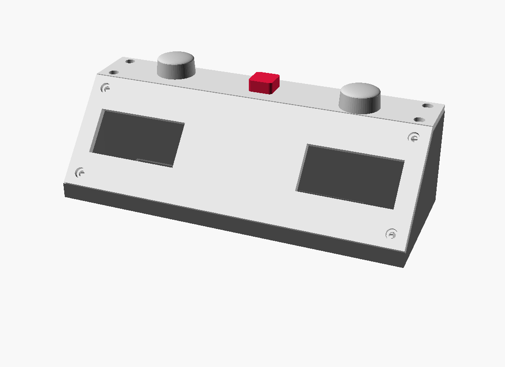

# click-clack

A Chronos-style chess clock built on ESP32-S3 with dual SPI OLEDs and Cherry MX switches.

## Layout

```
click-clack/
├── firmware/        PlatformIO project (ESP32-S3 + Arduino + U8g2)
│   ├── platformio.ini
│   └── src/
│       └── main.cpp
├── hardware/
│   ├── schematic.txt    ASCII wiring diagram for perfboard build
│   └── pinout.md        Pin assignments
└── case/
    ├── click-clack.scad  Parametric OpenSCAD case
    ├── render-preview.png Assembled render
    └── stl/              Ready-to-slice meshes (STL + Bambu 3MF)
```



## Hardware

- MCU: ESP32-S3-WROOM-1 DevKitC
- Displays: 2× 2.42" SSD1309 128×64 SPI OLED
- Switches: 7× Cherry MX (2 player, 4 menu, 1 center reset)
- Power: 1S LiPo + USB-C TP4056 + MT3608 boost
- Buzzer: passive piezo

See `hardware/pinout.md` for the full pin map and `hardware/schematic.txt` for wiring.

## Build

```
cd firmware
pio run -t upload
pio device monitor
```

## Case / 3D printing (Bambu Lab)

The case is two printed parts: a wedge-shaped lower **shell** and an angled
**top plate** that the switches and OLEDs mount into. Ready-to-slice meshes
are in `case/stl/` (both STL and Bambu Studio's native 3MF); the source of
truth is the parametric `case/click-clack.scad`.

| Part | File | Size | Orientation |
|---|---|---|---|
| Lower shell | `click-clack-bottom.{stl,3mf}` | 220 × 90 × 55 mm | floor on the bed |
| Top plate   | `click-clack-top.{stl,3mf}`    | 214 × 87 × 4 mm | flat, cosmetic face on the bed |

Both parts fit a 256 × 256 mm Bambu bed (X1 / X1C / P1S / P1P / A1) with room
to spare. The **A1 mini** (180 × 180) is too small for the 220 mm width.

Slice in **Bambu Studio** (drop in the 3MF, or import the STL):

- **Filament:** PETG or PLA+ — a chess clock gets slapped, and PETG shrugs off
  the repeated impact better than plain PLA.
- **Layer:** 0.20 mm · **Walls:** 4 perimeters · **Infill:** 20–30 % gyroid.
- **Supports:** none. The USB-C cutout is a short 10 mm bridge, the switch
  reliefs open upward, and every post is vertical.
- **Adhesion:** 5 mm brim on the shell — 220 mm of flat footprint can lift at
  the corners without one.

### How to print it

Start to finish on a Bambu Lab printer:

1. **Install Bambu Studio** (free, from the Bambu Lab site) and pick your
   printer + nozzle (0.4 mm) the first time you open it.
2. **Load the parts.** `File → Import → Import 3MF/STL` and select both
   `case/stl/click-clack-bottom.3mf` and `case/stl/click-clack-top.3mf` (or the
   `.stl` versions). They drop onto the plate already in the correct print
   orientation — shell floor-down, top plate flat — so **don't rotate them**.
   To print both at once instead, import the single `click-clack-plate.3mf`.
3. **Pick the filament** in the top-right dropdown (Bambu PETG HF or any
   PETG/PLA+ you have loaded), and set the print profile to **0.20 mm
   Standard**.
4. **Apply the settings** from the list above: in *Quality* set Wall loops = 4;
   in *Strength* set infill to 20–30 % Gyroid; in *Support* leave supports
   **off**; in *Others → Brim* choose Outer brim, 5 mm. (Saving these as a
   custom process preset means you only do it once.)
5. **Slice** (top-right) and sanity-check the preview: ~6–8 h total and ~150 g
   of filament for both parts. Scrub the layer slider — you should see no
   support structures.
6. **Print.** Send over the network or drop the `.3mf`/`.gcode` on the SD card.
   Use a clean PEI plate; for PETG, a glue-stick layer stops it bonding *too*
   hard. First-layer adhesion across the 220 mm shell is the main risk — that's
   what the brim is for.
7. **After printing:** peel the brim off, then press the M3 heat-set inserts
   into the shell posts with a soldering iron (~200 °C, push in square and
   let cool). The top plate screws down into them last, once the electronics
   are mounted.

No Bambu printer? The same STLs slice fine in PrusaSlicer/Cura, or upload them
to a print service (see `BOM.md`).

### Built to take a beating

Players hammer these buttons, so the top plate is engineered for it:

- 4 mm top plate (up from 3 mm) on a full-perimeter ledge — no corner-only span.
- Six M3 screw posts (corners + front/back centre) clamp the plate down.
- Two interior **support pillars** rise from the floor directly behind the
  player paddles, so a hard press transfers straight into the shell instead of
  flexing the plate.
- Each MX cutout has a proper 1.5 mm clip land with an underside relief, so the
  switches actually snap in and stay put under load.

Use M3 brass heat-set inserts in the shell posts and M3 screws (8–10 mm)
through the counterbores in the top plate.

Regenerate the meshes after editing the `.scad`:

```
cd case
openscad -o stl/click-clack-bottom.stl -D 'part="bottom"' click-clack.scad
openscad -o stl/click-clack-top.stl    -D 'part="top"'    click-clack.scad
```

## Controls (Chronos-style)

- **Player buttons** (left/right): press to end your move and start opponent's clock
- **Center small button**: pause / resume; long-press to reset to last loaded time control
- **Mode**: cycle between RUN, MENU, OPTIONS
- **Set**: in MENU, select field to edit; in OPTIONS, toggle setting
- **Up/Down**: adjust value

## Time controls

- Sudden death (e.g. 5+0, 3+0, 1+0)
- Fischer increment (e.g. 3+2, 5+3, 15+10)
- Each side configurable independently (asymmetric / odds games)

## Options (persisted to NVS)

- `stop_on_flag` — freeze game when a flag falls (default ON)
- `beep_on_flag` — buzzer on flag (default ON)
- `beep_on_move` — short click on each move press (default OFF)
- `low_time_warn` — beep at 10s/5s remaining (default ON)
- `brightness` — OLED contrast 0–255
- `default_tc` — time control loaded on power-up
